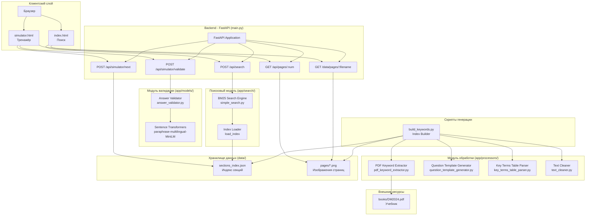
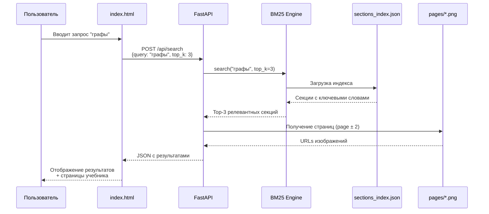
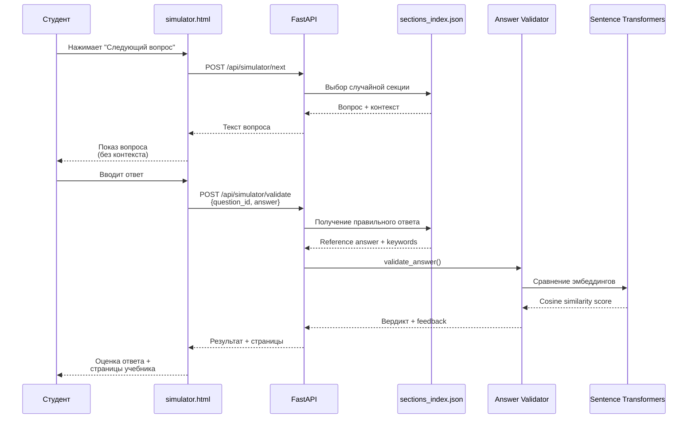
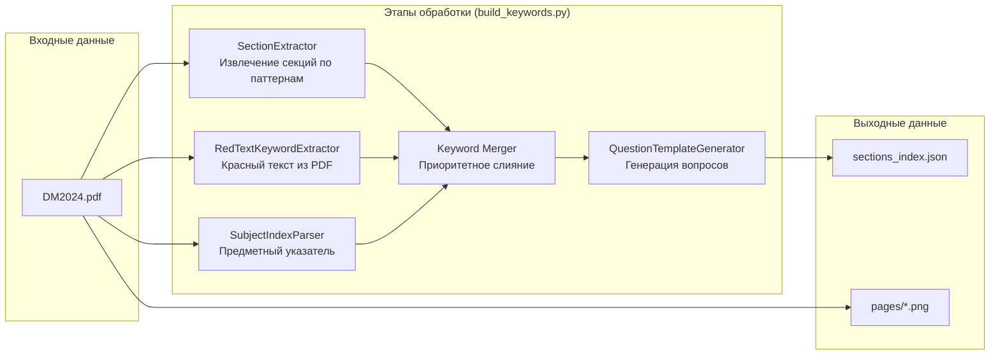
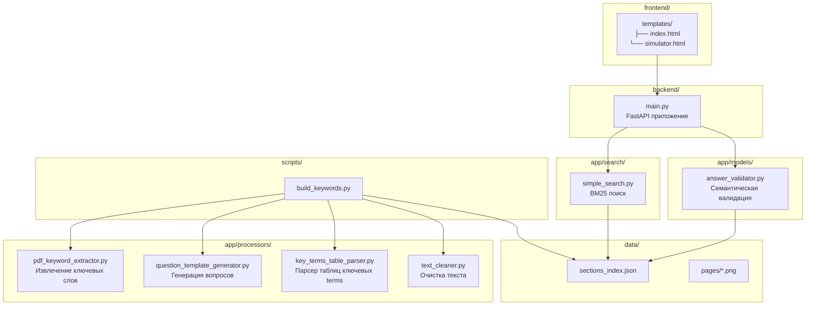
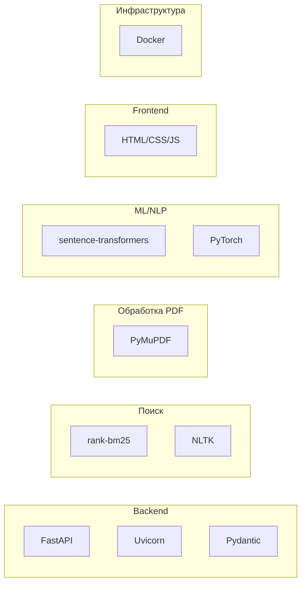
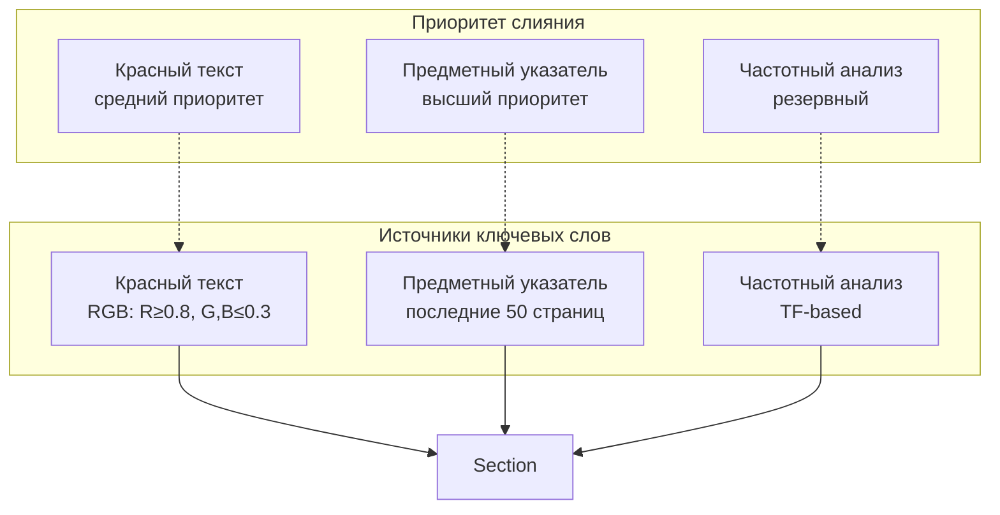

# Архитектура RAG-системы для учебника по дискретной математике

## Общая диаграмма архитектуры

## Диаграмма последовательности - Поиск

## Диаграмма последовательности - Тренажёр

## Pipeline генерации индекса

## Структура компонентов

## Технологический стек

## Диаграмма данных

